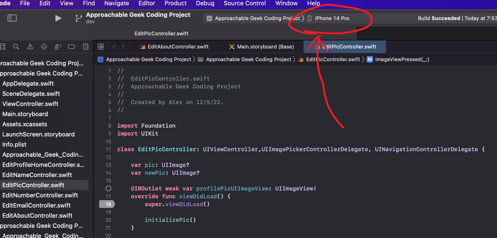
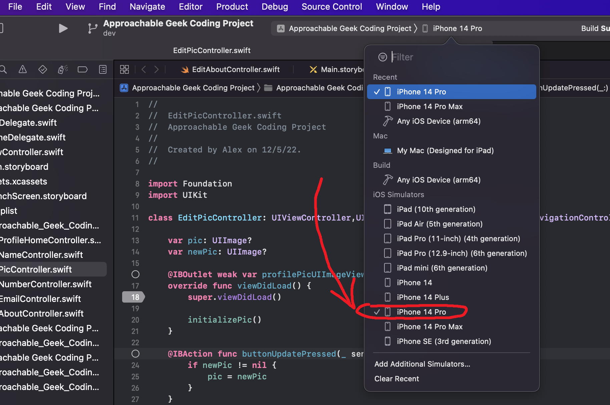
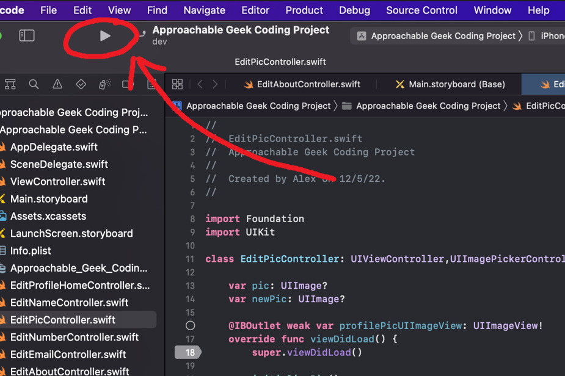
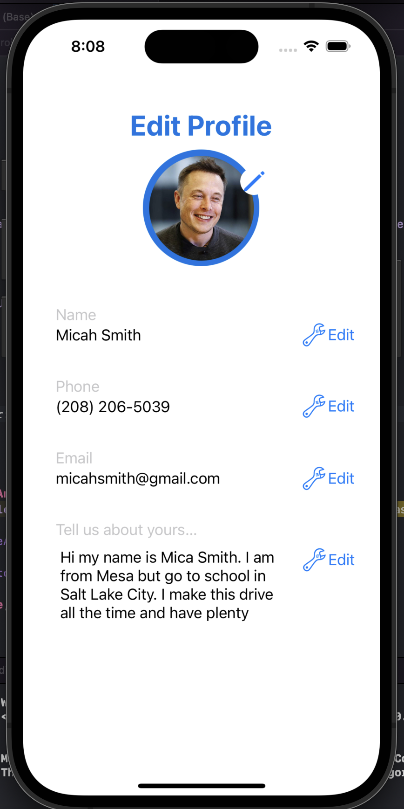

# Approachable-Geek-Coding-Project
#### By Alex Udodik

### **Installation:**
You will need a MacOS computer running Xcode.
This project wsa built entirely in the latest version of **Xcode Version 14.1 (14B47b)**

### **Opening the project**
Clone the github respository and make sure to be on the **main** branch.
Once the project is cloned, navigate within the respository folder. Open the "Approachable-Geek-Coding-Project" folder and find the file called "Approachable Geek Coding Project.xcodeproj.xcodeproj". This is the file needed to open the Xcode project workspace. Open the file and Xcode should open.

### **Running the project**
Once Xcode has been open and has finished loading, navigate to the emulator selection.

Go ahead and select the iPhone 14 Pro

Once the iPhone 14 Pro emulator has been selected, press the run button

On a successful launch, the emulator should look something like this:

